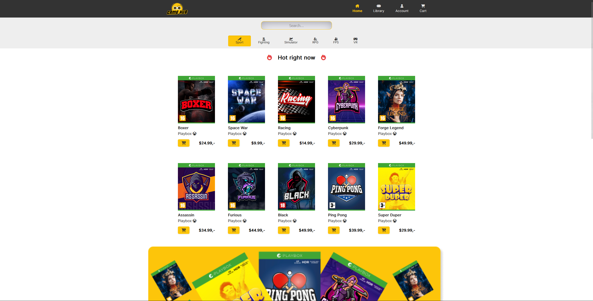

# Cross-Course Project




## Description

This cross-course project has been designed, developed and improved throughout my studies @.
The development of the project started when I enrolled into the school and with each passing course, the website was built upon and improved into what you see today (EU - 08.12.22 | US - 12.08.22).
In general, the website incorporates real-world project development processes that are focused on research-based and user-centric design and development methodologies.


## Built With

- HTML
- CSS
- Javascript
- WordPress - Restful API (WooCommerce Plugin)

## Getting Started

### Installing

1. Clone the repo:

```bash
git clone git@github.com:DrRuski/cross-course-project-IlyaMartchenko.git
```


## Contact

If you have any inquiries regarding my work or potential opportunities, you may contact me anytime at:

[My Portfolio](imdev.no) - Under Construction

[My Twitter](https://twitter.com/IlyaMartchenko)

[My LinkedIn](https://www.linkedin.com/in/ilya-martchenko/)


## Acknowledgments

Oliver Dipple - 
